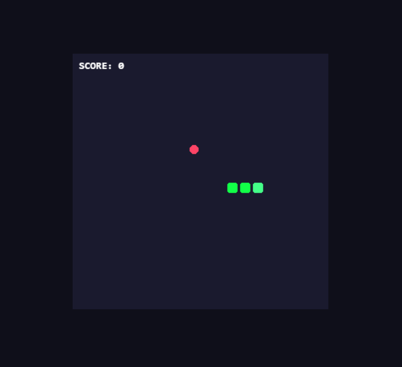

# Snake Game — PixiJS + TypeScript

A classic Snake game built with PixiJS v8 and TypeScript as a learning project 
to explore game architecture, scene management, and the PixiJS rendering engine.

## Live Demo
[Play here](#) ← сюди вставиш посилання на GitHub Pages або Vercel

## Screenshot


## Tech Stack
- **PixiJS v8** — WebGL 2D rendering engine
- **TypeScript** — type safety across all game classes
- **Vite** — fast dev server and build tool

## Architecture
The project follows a layered architecture with clear separation of concerns:
```
src/
├── main.ts              # Entry point — initializes PixiJS Application
├── constants.ts         # All game constants and Direction enum
├── scenes/
│   └── GameScene.ts     # Main scene — manages layers, ticker, game logic
├── entities/
│   ├── Grid.ts          # Grid rendering + cellToPixel() coordinate helper
│   ├── Snake.ts         # Snake segments, movement, collision detection
│   └── Food.ts          # Food spawning on random free cells
└── ui/
    ├── ScoreDisplay.ts  # Score label in UI layer
    └── GameOverScreen.ts # Game over overlay + restart handler
```

### Key architectural decisions

**Scene graph layering** — game objects and UI live in separate containers:
- `gameLayer` — grid, snake, food
- `uiLayer` — score display, game over screen (always rendered on top)

**Grid-based coordinates** — snake and food positions are stored as grid cells 
`{ col, row }`, not pixels. The `Grid.cellToPixel()` helper converts to screen 
coordinates only when rendering. This simplifies collision detection to simple 
integer comparisons.

**Tick-based movement** — the snake moves on a fixed interval (`TICK_INTERVAL = 150ms`) 
using a `tickTimer` accumulator inside the update loop, not on every frame. 
This keeps movement speed consistent regardless of frame rate.

**Clean destroy pattern** — `GameScene.destroy()` removes all ticker subscriptions 
and event listeners before the scene is garbage collected. Restart creates a 
fresh `GameScene` instance instead of manually resetting state.

## How to Run
```bash
npm install
npm run dev
```

## How to Build
```bash
npm run build
```

## Controls
| Key | Action |
|-----|--------|
| `W` / `↑` | Move up |
| `S` / `↓` | Move down |
| `A` / `←` | Move left |
| `D` / `→` | Move right |
| `Space` | Restart after game over |

## What I Learned
- Structuring a PixiJS project with scenes, layers, and entities
- Separating rendering logic from game logic
- Managing the game loop with `Ticker` and fixed time steps
- Proper cleanup of event listeners and ticker subscriptions to avoid memory leaks
- TypeScript interfaces for shared data types across classes
