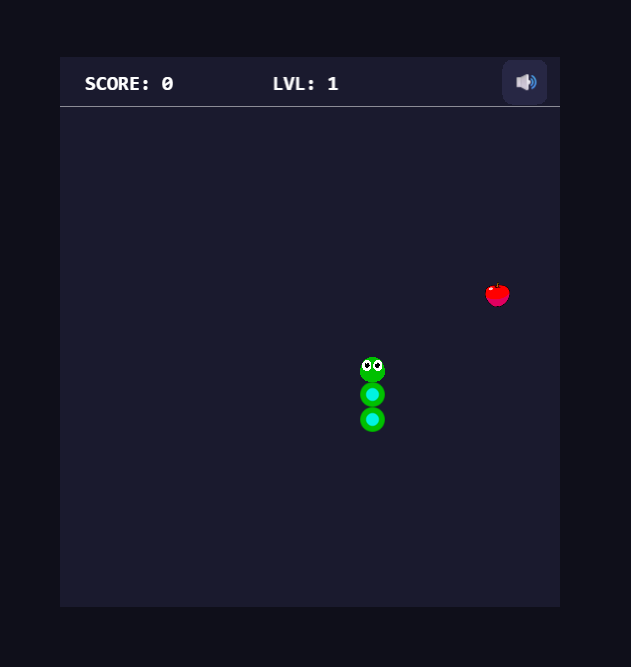

# Snake Game — PixiJS + TypeScript

A classic Snake game built with PixiJS v8 and TypeScript as a learning project
to explore game architecture, scene management, and the PixiJS rendering engine.

## Screenshot v1.0.0

## Screenshot v2.0.0


## Tech Stack
- **PixiJS v8** — WebGL 2D rendering engine
- **@pixi/sound** — audio plugin for sound effects
- **TypeScript** — type safety across all game classes
- **Vite** — fast dev server and build tool

## Architecture
The project follows a layered architecture with clear separation of concerns:
```
```
src/
├── main.ts                  # Entry point — initializes PixiJS Application
├── constants.ts             # All game constants and Direction enum
├── scenes/
│   ├── GameScene.ts         # Main scene — manages layers, ticker, game logic
│   └── MenuScene.ts         # Start screen — title, best score, play button
├── entities/
│   ├── Grid.ts              # Grid rendering + cellToPixel() coordinate helper
│   ├── Snake.ts             # Snake segments, movement, collision detection
│   └── Food.ts              # Food spawning on random free cells
├── audio/
│   └── SoundManager.ts      # Sound effects — eat, game loop, death
├── input/
│   └── GamepadController.ts # Gamepad support — D-pad, left stick, Start
└── ui/
    ├── ScoreDisplay.ts      # Score label in UI layer
    ├── LevelDisplay.ts      # Level label in UI panel
    ├── MuteButton.ts        # Toggle all sounds on/off
    ├── PauseScreen.ts       # Pause overlay
    └── GameOverScreen.ts    # Game over overlay + best score + restart
```
### Key architectural decisions

**Scene graph layering** — game objects and UI live in separate containers:
- `gameLayer` — grid, snake, food (offset by `UI_HEIGHT`)
- `uiLayer` — score, level, mute button, pause screen, game over (always on top)

**UI panel above game field** — a dedicated `UI_HEIGHT = 40px` strip sits above
the game field. Score is on the left, level in the center, mute button on the right.
This keeps UI elements from overlapping game content.

**Grid-based coordinates** — snake and food positions are stored as grid cells
`{ col, row }`, not pixels. The `Grid.cellToPixel()` helper converts to screen
coordinates only when rendering. This simplifies collision detection to simple
integer comparisons.

**Tick-based movement** — the snake moves on a fixed interval (`TICK_INTERVAL = 150ms`)
using a `tickTimer` accumulator inside the update loop, not on every frame.
This keeps movement speed consistent regardless of frame rate.

**Difficulty scaling** — every `SCORE_PER_LEVEL = 5` apples, the tick interval
decreases by `SPEED_INCREASE = 10ms` down to a minimum of `MIN_TICK_INTERVAL = 60ms`.
Level is tracked separately from score and displayed in the UI panel.

**Clean destroy pattern** — `GameScene.destroy()` removes all ticker subscriptions
and event listeners before the scene is garbage collected. Restart navigates back
to `MenuScene` instead of resetting state manually.

**SoundManager** — all audio logic is isolated in one class. Sounds are registered
once using `sound.exists()` to prevent duplication on restart. `GameScene` calls
`playEat()`, `startGameLoop()`, `pauseGameLoop()` without knowing implementation details.

**GamepadController** — polls `navigator.getGamepads()` every frame inside
`update()`. Tracks previous button states to detect new presses only, preventing
repeated direction changes from a held button.
## How to Run
```bash
npm install
npm run dev
```

## How to Build
```bash
npm run build
```

## How to Deploy
```bash
npm run deploy
```

## Controls

### Keyboard
| Key | Action |
|-----|--------|
| `W` / `↑` | Move up |
| `S` / `↓` | Move down |
| `A` / `←` | Move left |
| `D` / `→` | Move right |
| `P` / `Escape` | Pause / Resume |
| `Space` | Start game / Restart |

### Gamepad
| Input | Action |
|-------|--------|
| Left stick / D-pad | Move snake |
| Start button | Pause / Resume |

## Sound Effects
| Event | Sound |
|-------|-------|
| Snake moves | Background loop |
| Snake eats food | Short pop |
| Game over | Descending tone |
| Mute button | Toggle all sounds |

## Features
- Classic Snake gameplay on a 20×20 grid
- Sprite-based snake — custom head with directional rotation
- Apple sprite for food
- Difficulty levels — speed increases every 5 apples
- Best score saved between sessions via `localStorage`
- Pause / Resume — keyboard and gamepad
- Mute button — toggles all sounds
- Menu screen with best score display
- Game Over screen with current score and best score highlight
- Gamepad support — D-pad, left stick, Start button
- Deployed to GitHub Pages

## What I Learned
- Structuring a PixiJS project with scenes, layers, and entities
- Separating rendering logic from game logic
- Managing the game loop with `Ticker` and fixed time steps
- Proper cleanup of event listeners and ticker subscriptions to avoid memory leaks
- TypeScript interfaces for shared data types across classes
- Integrating audio with `@pixi/sound` — loop, pause, resume, mute
- Loading and scaling PNG sprites via `Assets.load()`
- Sprite rotation for directional head movement
- Gamepad API — polling, button state tracking
- Difficulty scaling through dynamic tick interval
- Deploying a Vite project to GitHub Pages
